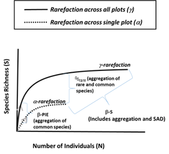
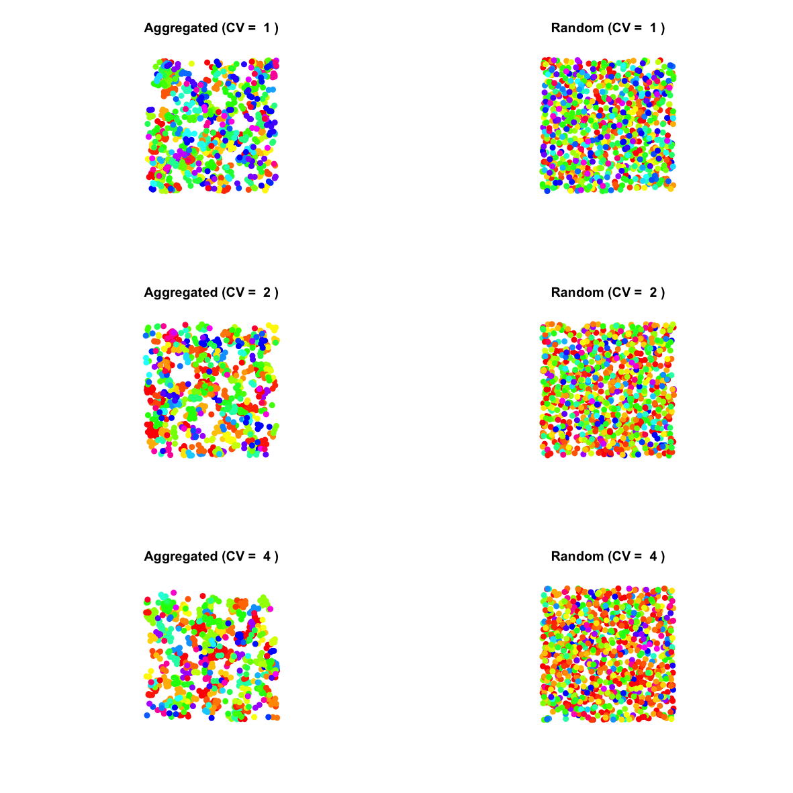
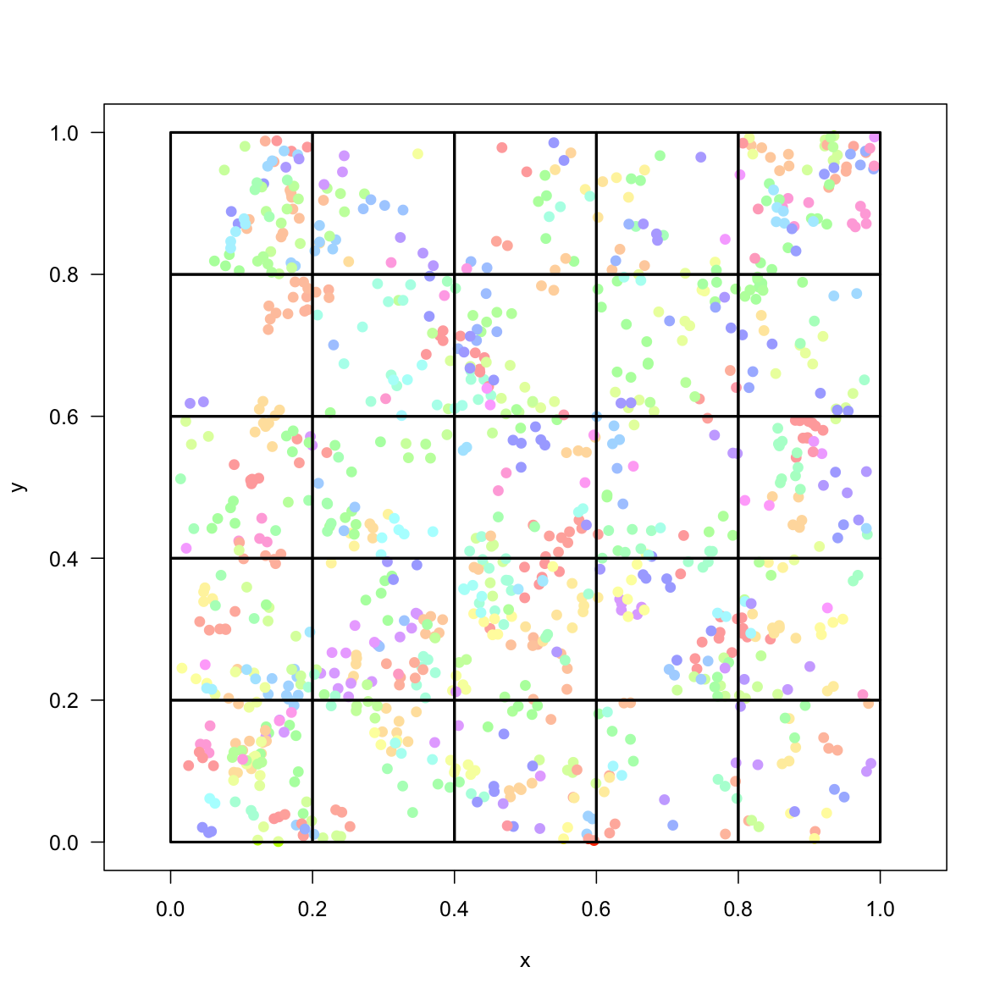
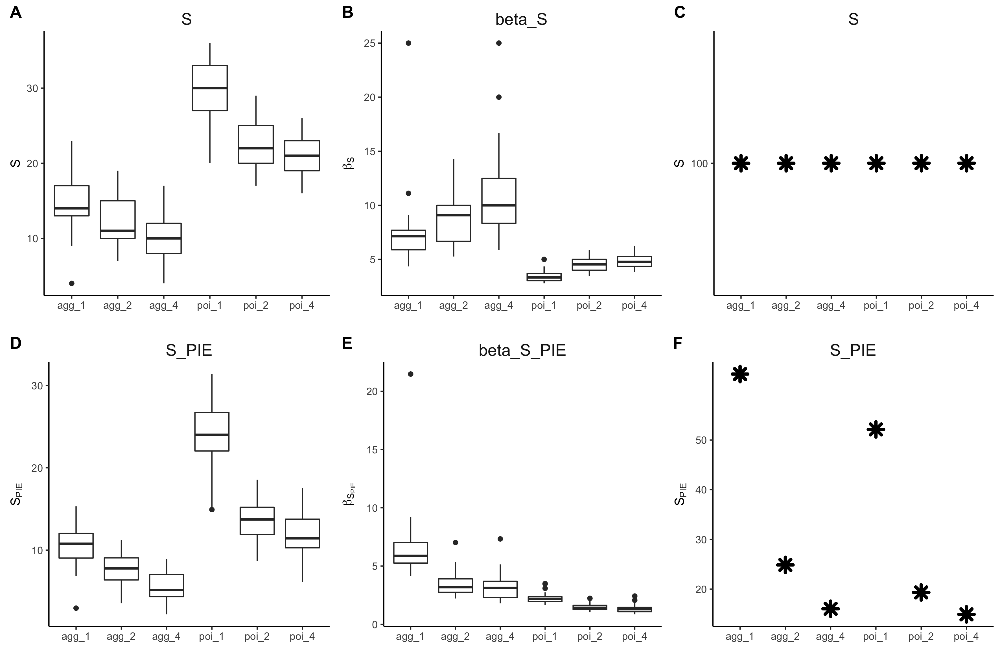
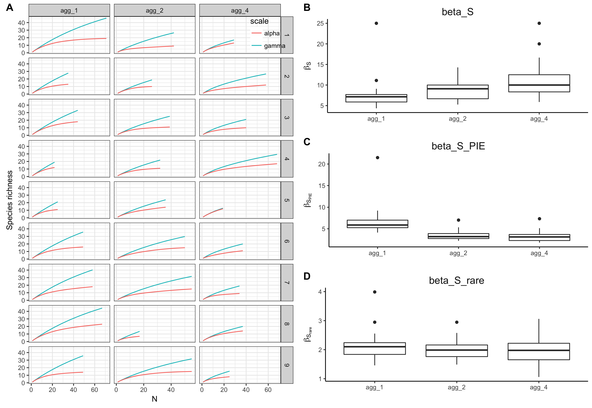
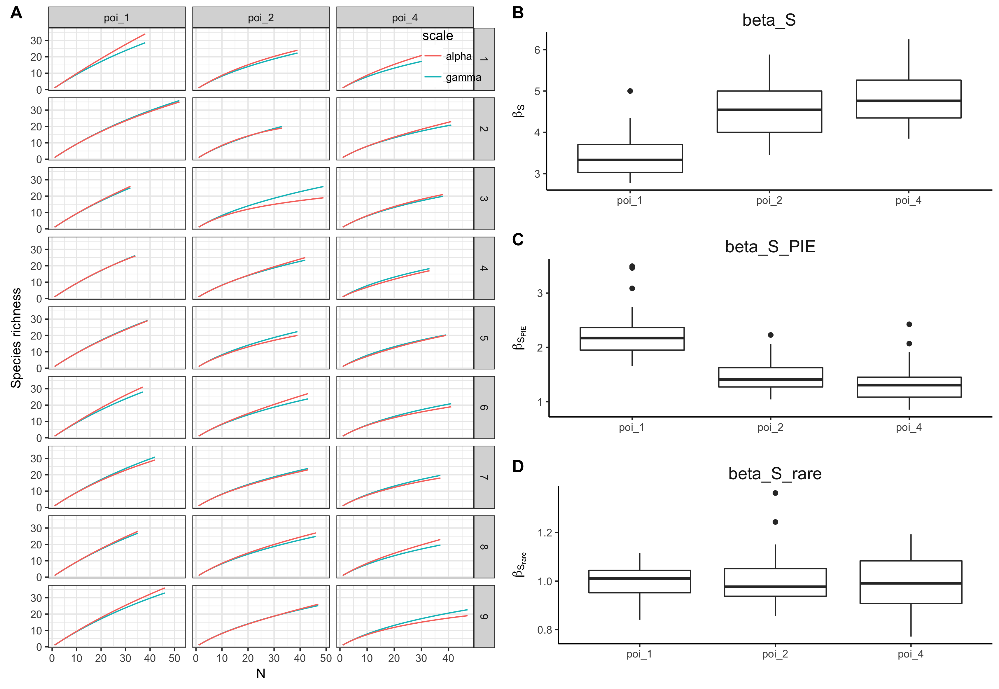
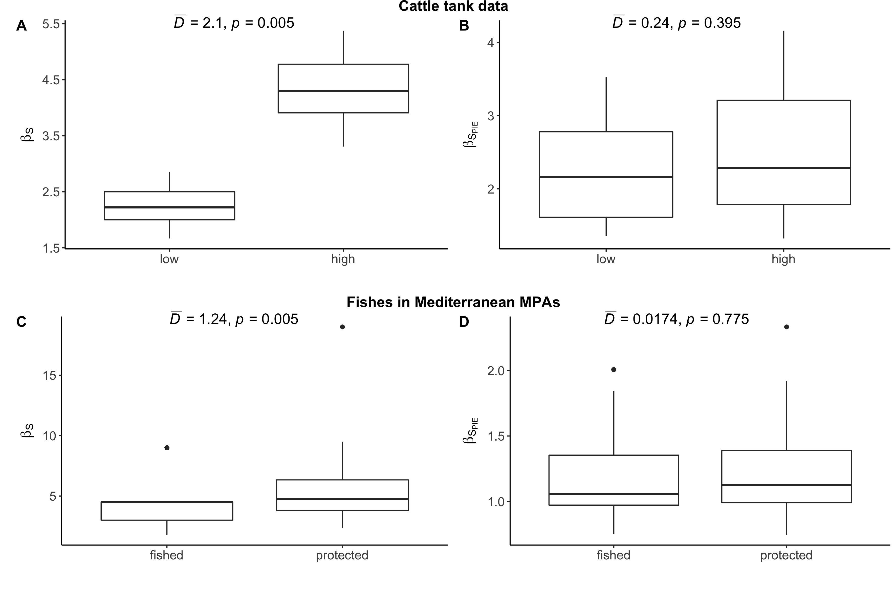
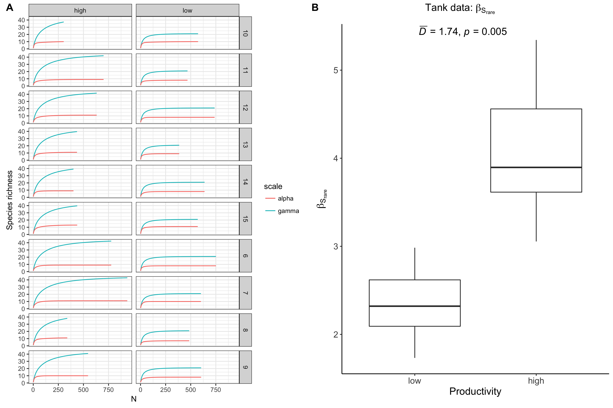
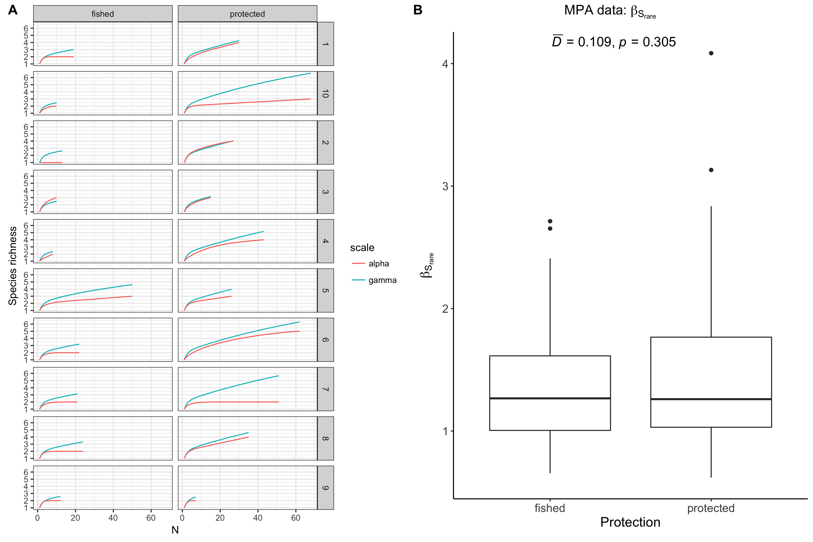

```{r setup, include=FALSE}
knitr::opts_chunk$set(echo = TRUE)
knitr::opts_knit$set(progress = FALSE)

# load packages
rm(list=ls())
library(mobr)
library(mobsim)
library(tidyverse)
library(cowplot)
```

## $\beta$-diversity: $\beta_S$, $\beta_{S_{PIE}}$ and $\beta_{S_{rare}}$
The `mobr` concept paper and package focuses on two $\beta$ diversity metrics: $\beta_S$ and $\beta_{S_{PIE}}$:

>    $\beta_S$ =  $\frac{^\gamma S}{^\alpha S}$. The ratio of $\gamma$-scale S over $\alpha$-scale S; this turnover metric is influenced by aggregation and the whole SAD; and,  
>    $\beta_{S_{PIE}}$ = $\frac{^\gamma S_{PIE}}{^\alpha S_{PIE}}$. Here *q* = 2 and the turnover metric is more strongly influenced by common species. 

  

 
  
The diversity order *q*=2 of $\beta_{S_{PIE}}$, means it is telling us something about the aggregation of common species, but we cannot get directly at the aggregation of rare species with either $\beta_{S}$ or $\beta_{S_{PIE}}$. Can we use $\beta_{S_{rare}}$ = $\frac{^\gamma S_{n}}{^\alpha S_{n}}$, where the $\gamma$-scale rarefaction curve is rarefied to the $\alpha$-scale *n* values, to tell us something about aggregation of rare species? Note, I've used the notation $\beta_{S_{rare}}$ here, and not $\beta_{S_{n}}$, as `mobr` already calculates $\beta_{S_{n}}$ by taking the ratio of $^\gamma S$ over the $\alpha$-scale rarefaction curves rarefied to the lowest observed $\alpha$-scale *n* (or some other desired $\alpha$-scale effort).

## Simulation study
To examine whether we can infer aggregation of rare species with $\beta$-diversity metrics, I first simulated regional communities where species were either distributed randomly (poisson) or aggregated in space. All regional communities were assembled assuming lognormal SADs, and had 1000 individuals and 100 species. The CV of the lognormal distribution was varied so as communities were more (CV=1) or less even (CV=2,4; Fig 2), though by forcing each landscape to have 1000 individuals and all 100 species, small departures from the specified CV parameters are expected.

```{r, echo=FALSE, warning=FALSE}
source('~/Dropbox/1current/conceptual/code/betaD_metrics/1simulate_and_sample.R')
```

  
    
  
Next, I sample from these communities. To avoid introducing variation due to sampling alone, I completely sampled the whole regional community ($N_{quadrats}$ = 25; Fig. 3).

  
$\alpha$-scale diversity is higher in the communities assembled where species are distributed randomly in space (Fig. 4A, 4D). Whereas $\beta$-diversity, both $\beta_{S}$ (Fig. 4B) and $\beta_{S_{PIE}}$ (Fig. 4E) is greater for the communities with aggregated species distributions. 

```{r, echo=FALSE, message=FALSE, warning=FALSE}
source('~/Dropbox/1current/conceptual/code/betaD_metrics/2metrics_and_rarefaction.R')
```


  
Now, lets look at the aggregated and random communities separately. Specifically, the $\alpha$- and $\gamma$-scale rarefaction curves along side all the $\beta$-diversity metrics: $\beta_S$, $\beta_{S_{PIE}}$ and $\beta_{S_{rare}}$.

For the aggregated communities, we can see obvious separations between the $\alpha$- and $\gamma$-scale rarefaction curves (where the $\gamma$ curve has been rarefied the $\alpha$-scale *n*; Fig. 5A). And this is captured by $\beta_{S_{rare}}$: it is > 1 regardless of how uneven the regional SAD is, and there is no strong patterns with increasing unevenness (Fig. 5D). So, I think in addition to the aggregation of the common species captured by $\beta_{S_{PIE}}$ (Fig. 5C), we are getting capturing aggregation among rare species wtih $\beta_{S_{rare}}$.
  



In contrast to the aggregated landscapes, there is no trend for separation between the rarefaction curves for the random landscapes (Fig. 6A). Similarly, $\beta_{S_{rare}}$ is not different from 1, regardless of how uneven the SAD is (Fig. 6D). So, for the random landscapes, $\beta_{S_{PIE}}$ suggests that we have some aggregation of common species that declines with with increasingly uneven regional SADs (Fig. 6C). And the increasing $\beta_S$ for increasingly uneven regional SADs is likely not due to aggregation, but is associated with the increased numbers of individuals at the $\gamma$-scale and changes to the whole SAD.
  
  


## Case study in two parts  

The effects of productivity in Jon's cattle tank experiment, and protection inside marine reserves in the Mediterranean, produce qualitatively similar patterns of $\beta_S$ and $\beta_{S_{PIE}}$. Both productivity and protection significantly increase $\beta_S$ (Fig. 7A, C), but do not change in $\beta_{S_{PIE}}$ (Fig. 7B, D). This suggests that the treatments are not leading to aggregation among common species, but based on $\beta_S$ alone, we cannot say anything concrete about treatment effects on the aggregation of rare species.  




However, differences between the tank and the MPA data do appear in $\beta_{S_{rare}}$.

First, for the tank data, we can see that when rarefy the $\gamma$-scale curve to $\alpha$-scale *n*, the rarefaction curves still clearly diverge (Fig 8A). And the divergence is greater in the high productivity treatment (Fig 8B).  




But for the MPA data, divergences between the rarefaction curves are much more variable: some diverge, others do not (Fig 9A). And there is no effect of protection on $\beta_{S_{rare}}$ (Fig 9B).  




So, for the tank data we have productivity significantly increasing $\beta_S$ and $\beta_{S_{rare}}$, but not $\beta_{S_{PIE}}$. I think this suggests that there is aggregation among rare, but not common species, in the high productivity tanks. In contrast, protection in Mediterranean MPAs increases only $\beta_S$, but not $\beta_{S_{PIE}}$ or $\beta_{S_{rare}}$. I think this suggests that protection is not resulting in any increase in aggregation. Rather the increased $\beta_{S}$ is due to changes to the whole SAD and is also associated with more individuals in the protected areas.